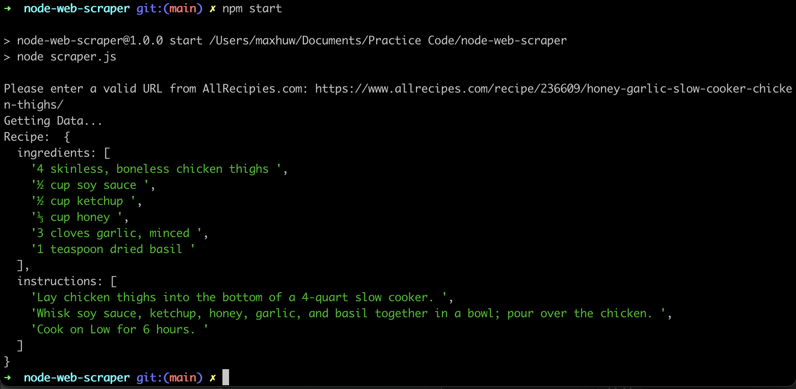

# DISCLAIMER

This scraper is for learning purposes only, and should not be used to steal data that does not belong to you.

## Node Web Scraper

This is a simple web scraper built using Node. It uses Cheerio, Axios and Readline to pull recipe information for an allrecipes.com page, and return it as an object in the console.

## Set Up

After downloading the repo, use `npm install` to get set up. Then run `npm start` to use the script. You will be prompted to enter a URL for a recipe found on AllRecipes.com. Paste a URL in, then hit enter. A moment later, you should see an object with the ingredients, and instructions for that recipe.

NOTE: Currently, only the TypeScript file will run (which `npm start` should handle).

Some example URLS:

- https://www.allrecipes.com/recipe/219988/cajun-crab-cakes-no-breadcrumbs/
- https://www.allrecipes.com/recipe/236609/honey-garlic-slow-cooker-chicken-thighs/
- https://www.allrecipes.com/recipe/260540/chef-johns-sourdough-bread/

## Screenshot

